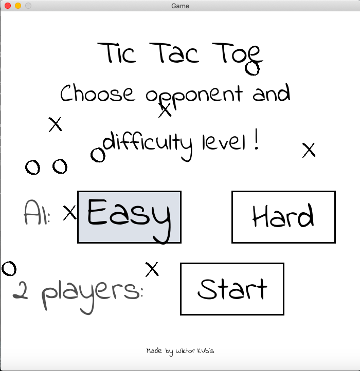
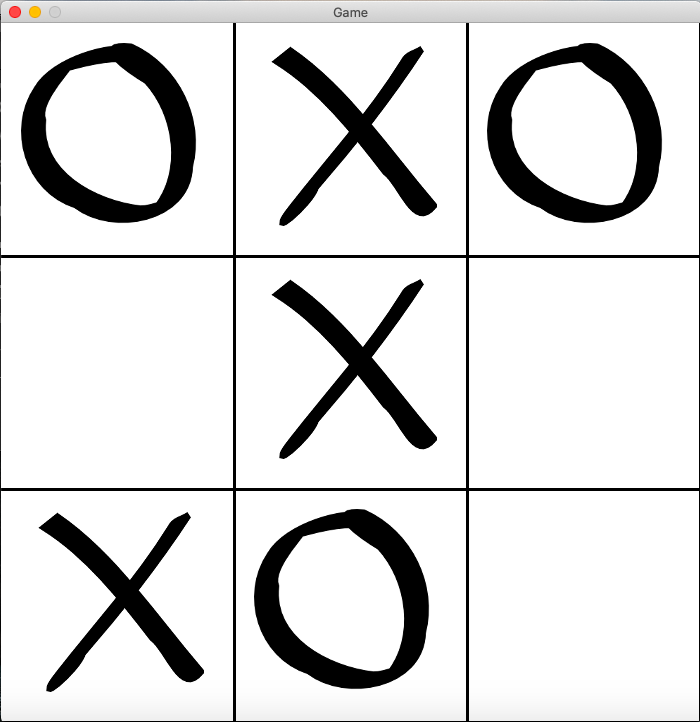

# Java-TicTacToe
Graphical TicTacToe made in Processing Java with AI algorithm (minimax)

How to run:
 - Add libraries to your project that are in folder "ProcessingLib"
 - Link "media" as your resources folder
 - Run Game file in src directory.